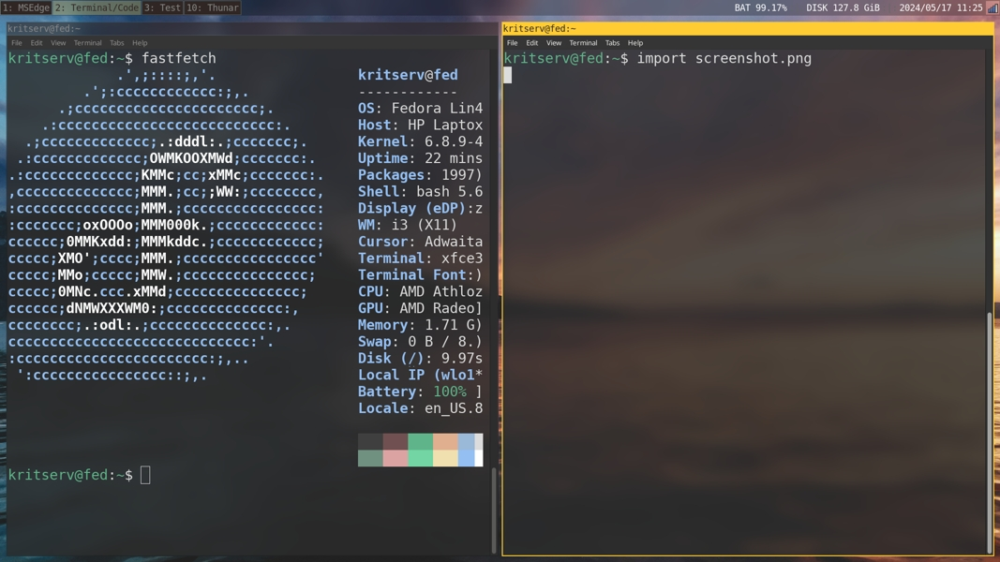

# My fedora i3 settings

```
git clone https://github.com/kritserv/my-i3-fedora-config.git
```

## Installation

```
chmod +x my-i3-fedora-config/first_setup.sh
```

```
su
```

```
. my-i3-fedora-config/first_setup.sh
```

```
reboot
```

wallpaper: <a href="https://unsplash.com/photos/calm-sea-under-clear-blue-sky-A-8glbZbeKw">unsplash link</a>


